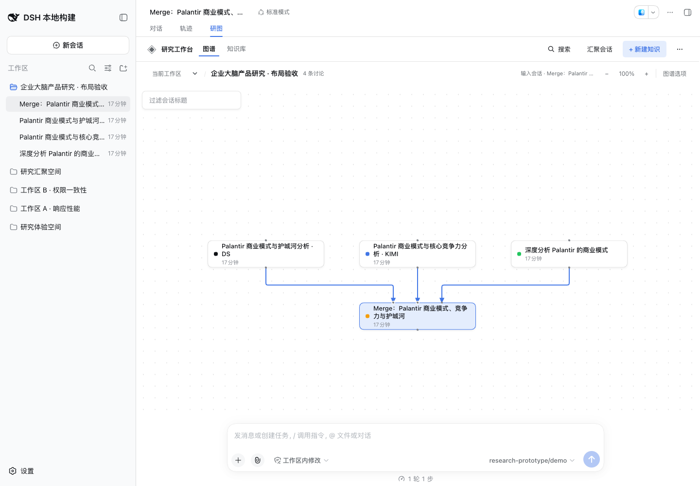
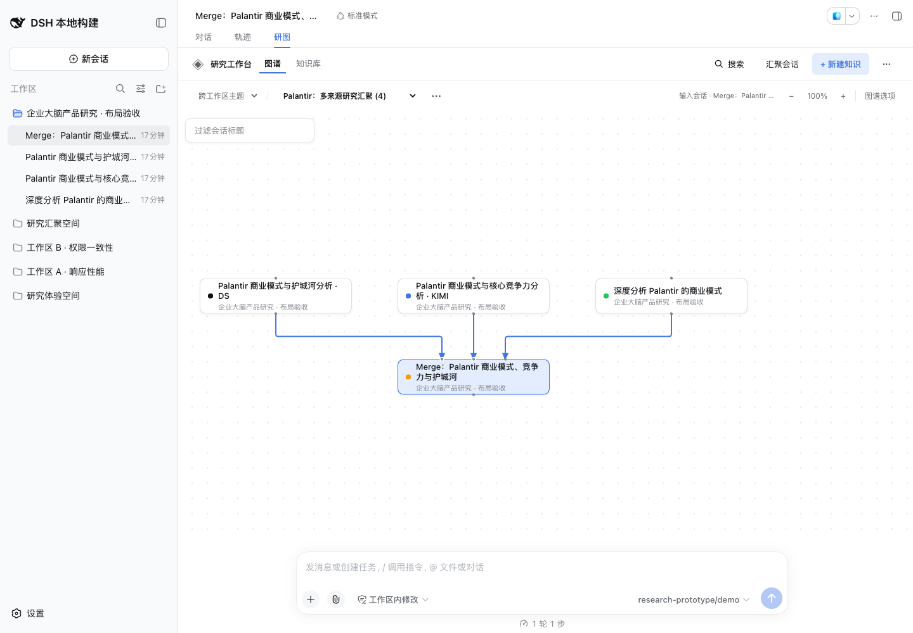
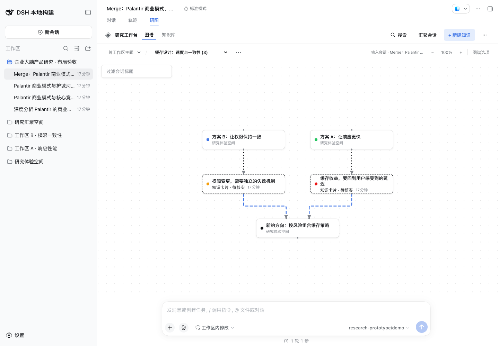

# Relayout acceptance — 2026-09-13

Both Workspace and Research Topic graphs now arrange connected sources in dependency rows, retain Branch clusters, and route relations after all manual positions, collapse choices, and cluster offsets. Arrowheads and visual terminals use the actual endpoints; Fit includes outer routes and labels. Relayout retains one undo without changing reading state or implicitly saving a topic through the Host.

The supplied three-source Merge screenshot was reproduced before implementation: three unrelated-node penetrations and three collinear edge pairs. Increasing spacing retained all six defects. Regression cases now cover that Merge, twelve sources, skip-level and feedback edges, compact Branch frames and their title bands, dense paths, label bounds, a 10,000-node Branch chain, and a very distant manually positioned member. The selected fan-in/feedback/manual-column cases have no shared collinear segments. Dense nonplanar relations can still cross; physically overlapping cards can leave a terminal unreachable until rearranged.

Validation:

- `pnpm run check`: strict types, build, 208 standalone tests.
- Matching `dsh-v0.1.5-rc.2` checkout (`fb2c4b9`), `pnpm check:harness`: four compiler faces and 337 Harness tests. Existing rendered-view regressions now also assert reading continuity, repeat-Relayout undo, invalidation after another arrangement action, and topic undo without a Host write.
- Packed-profile acceptance: actual archive install, boot, persistent topic/knowledge/Merge operations, frozen synthesis/reuse, historical Branch recovery, and removal using the fixed demo model.
- Chrome 153.0.8010.36, real isolated DSH profile, 1440×1000 and 900×820: Workspace Merge, Topic Merge, and discussion → knowledge → follow-up routes were sampled from the actual SVG curves. No card penetration or arrow-tip mismatch was found. Real pointer drags into a manual column, repeated Relayout, Undo, and reopening retained the expected positions; no browser errors occurred.
- Local geometry timings: 100 nodes / 197 edges ≈38 ms; 100 / 485 ≈69 ms; 300 / 597 ≈143 ms. These are diagnostic observations, not browser interaction guarantees.

The original user profile was not used. No runtime dependency or package version changed. The routing choice is recorded in [ADR 0016](../adr/0016-route-relations-after-arrangement.md).

Workspace Merge:

Topic Merge:

Knowledge and follow-up discussion:

